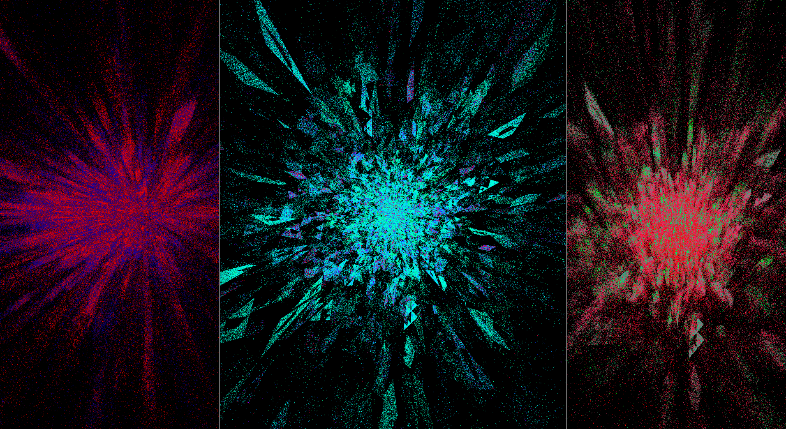
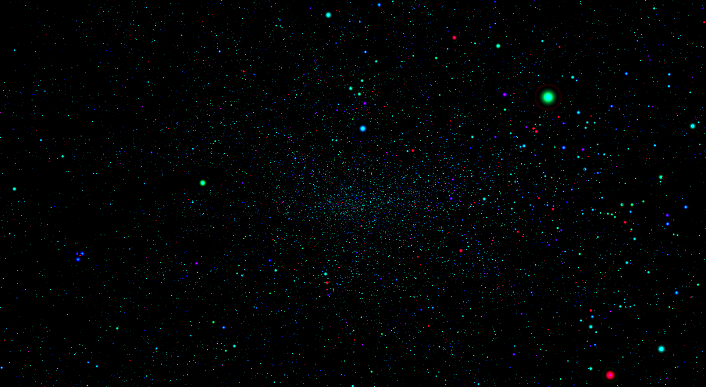
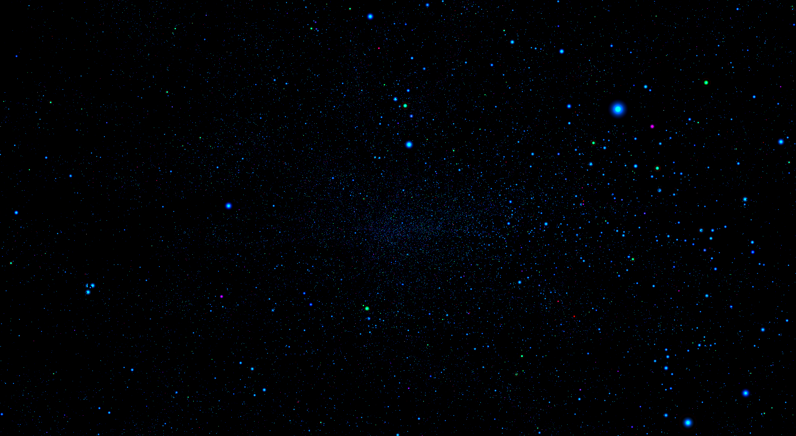

# SIDERA

A 3d representation of the Gaia (Early) Data Release 3 Universe Model data uploaded by the European Space Agency (see [Gaia mission](https://www.esa.int/Science_Exploration/Space_Science/Gaia)).

[TOC]

## Build status

@note _This is a pre-release version, first release is expected to be available by the end of **August 2024**._

Programs and libraries are frequently being tested on Windows 11, and Linux Mint (wsl and physical machine) with different compilers (`MSVC`, `gcc`), and hardware configurations (`RX580 4GB GDDR5`, `Radeon V Carrizo 500MB`).

## Features

 * 3d plot customization using `.smd` files, see [`settings.smd`](./gaia-universe-model/smd/settings.smd).
 * After downloading Gaia Universe Model data, load as many celestial bodies as you need in the scene, see [`settings.smd`](./gaia-universe-model/smd/settings.smd).
 * Decide what parameters to read (`xyz` parameter types + color_filter). To find what parameters are compatible, see [`settings.smd`](./gaia-universe-model/smd/settings.smd).
 * Graphics settings options: view modes (cartesian, polar), shade types (pixel, circle, cloud, animated cloud), see [`settings.smd`](./gaia-universe-model/smd/settings.smd). 
 * Easily add new graphics features using the [`Vulkan API`](https://www.vulkan.org/) through [`shvulkan`](https://github.com/mrsinho/shvulkan)

 

## To do

 * GDR3 update
 * Time simulation
 * Shci tests
 * Write header documentation

## Documentation

See the [`related pages`](https://mrsinho.github.io/sidera-docs/pages) for further documentation.

## Dependencies and credits

 * [`Gaia Early Data Release 3`](https://www.cosmos.esa.int/web/gaia/early-data-release-3)
 * [`gaia-resources`](https://github.com/mrsinho/gaia-resources)
 * [`shengine`](https://github.com/mrsinho/shengine)
 * [`vulkan`](https://www.vulkan.org/)
 * [`shvulkan`](https://github.com/mrsinho/shvulkan)
 * [`gaia-archive-tools`](https://github.com/mrsinho/gaia-archive-tools)
 * [`cglm`](https://github.com/recp/cglm)
 * [`glfw`](https://github.com/glfw/glfw)
 * [`smd`](https://github.com/mrsinho/smd)

## Feedback and contributing

I have been personally dedicated to this project since the beginning of 2022, investing a significant amount of my spare time developing the engine and working on new features. Should you encounter any issues with the application or wish to introduce new features while addressing existing ones, I welcome your contributions to the repository. You can contribute by either opening an issue or submitting a pull request.

