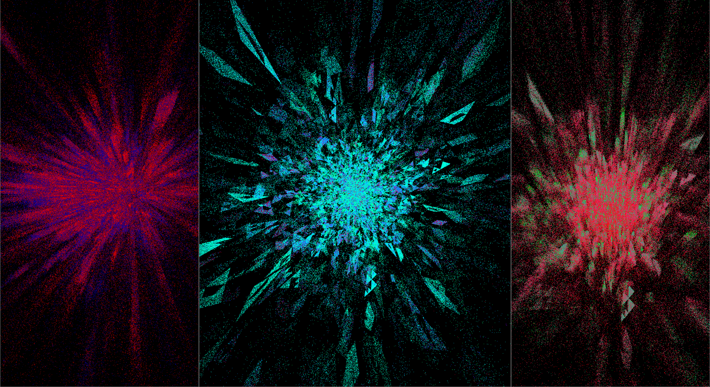
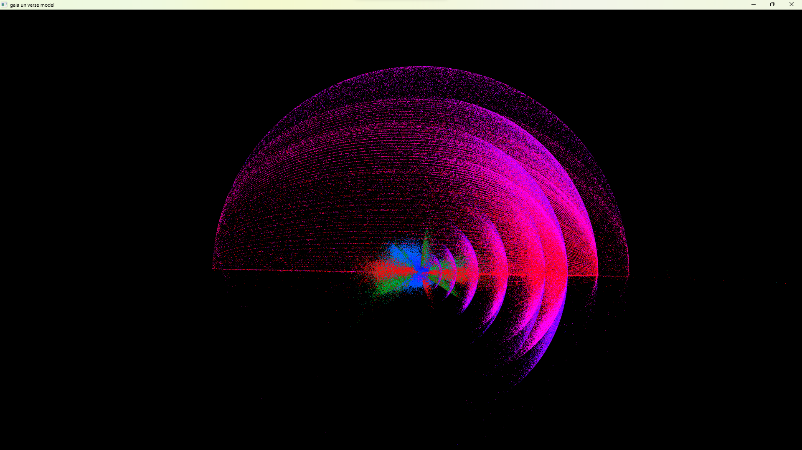
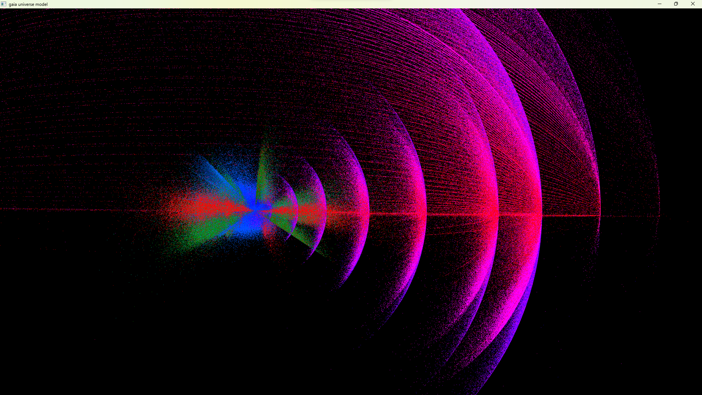
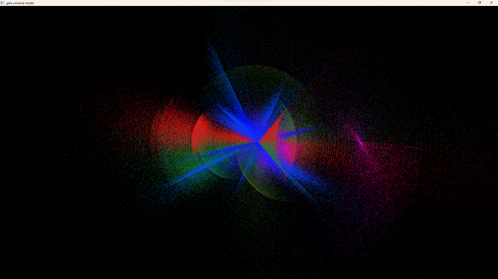
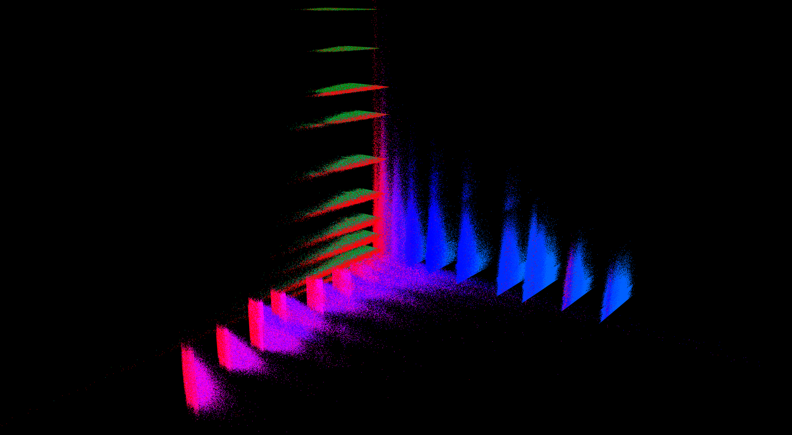

# gaia-universe-model

_Check the linux and windows build logs:_

[](.shci/linux/log.md)
[](.shci/windows/log.md)

A static 3d representation of of the Gaia (Early) Data Release 3 Universe Model data uploaded by the European Space Agency.



---

## Build status

Programs and libraries are frequently being tested on Windows 11, and Linux Mint (virtual machine and pc) with different compilers (`MSVC`, `gcc`), and hardware configurations (`RX580 4GB GDDR5`, `Radeon V Carrizo 500MB`).



---

## Documentation

 * [`Quick install`](docs/quick-install.md)
 * [`Clone and build`](docs/clone-and-build.md)
 * [`Download universe model data`](docs/download-universe-model-data.md)
 * [`Runtime tutorial`](docs/runtime-tutorial.md)

---

## Features

 * 3d plot customization using `.smd` files, see [`settings.smd`](./gaia-universe-model/smd/settings.smd).
 * After downloading Gaia Universe Model data, load as many celestial bodies as you need in the scene, see [`settings.smd`](./gaia-universe-model/smd/settings.smd).
 * Decide what parameters to read (`xyz` parameter types + color_filter). To find what parameters are compatible, see [`settings.smd`](./gaia-universe-model/smd/settings.smd).
 * Graphics settings options: view modes (cartesian, polar), shade types (pixel, circle, cloud, animated cloud), see [`settings.smd`](./gaia-universe-model/smd/settings.smd). 




---

## Clone and build (CMake)

To generate the CMake targets, open the terminal and run the following commands:

```bash
git clone --recursive https://github.com/MrSinho/gaia-universe-model.git
cd gaia-universe-model
cd external/shengine
python export-application.py name=gaia-universe-model target=EXECUTABLE path=../../gaia-universe-model
```

if you get a python syntax error specify the python version (must be 3.0 or greater).




On Windows:
```bash
cd gaia-universe-model/windows/build
cmake --build .
```
The windows binaries are compiled at gaia-universe-model/windows/bin

On Linux:
```bash
cd gaia-universe-model/linux/build
cmake --build .
```

The linux binaries are compiled at gaia-universe-model/linux/bin

