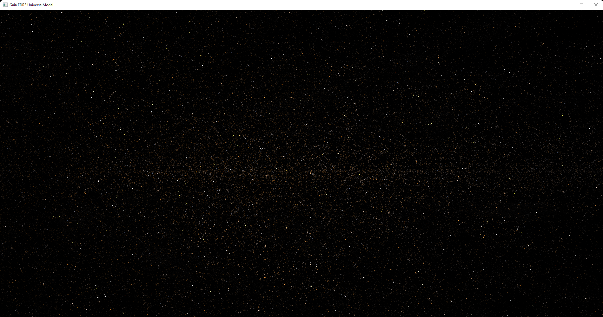
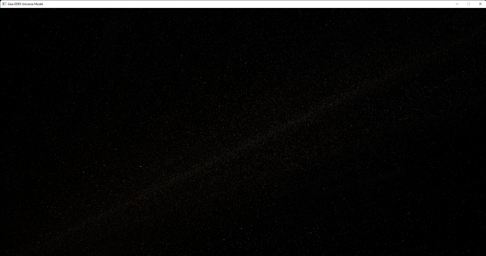
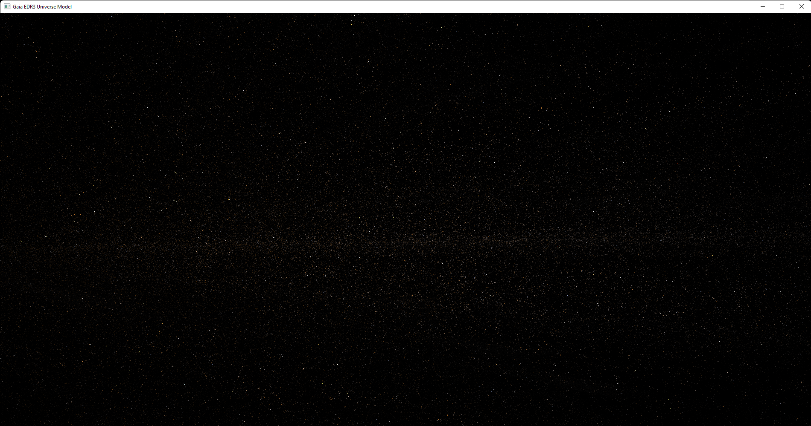

# Gaia EDR3 Universe Model


## Gaia Data License

*The Gaia data are open and free to use, provided credit is given to 'ESA/Gaia/DPAC'. In general, access to, and use of, ESA's Gaia Archive (hereafter called 'the website') constitutes acceptance of the following general terms and conditions. Neither ESA nor any other party involved in creating, producing, or delivering the website shall be liable for any direct, incidental, consequential, indirect, or punitive damages arising out of user access to, or use of, the website. The website does not guarantee the accuracy of information provided by external sources and accepts no responsibility or liability for any consequences arising from the use of such data.*

## About the application

The simulation uses a binary version of the [Gaia Universe model](https://gaia.aip.de/) csv files uploaded by the [European Space Agency](https://www.esa.int/).

## [3D Rendering](https://github.com/MrSinho/ShVulkan)

The application renders part of the universe model using the [SH-Engine](https://github.com/MrSinho/SH-Engine), a Vulkan based graphics engine that is still in development. 


## Memory Management

The amount of data loaded in the application depends on how much vram is available for use. 
A buffer that holds a celstial body looks like the following C structure:
```c
//Example of celestial body structure
typedef struct celestial_body {
    float ra;
    float dec;
    float baricentric_distance;
    float teff;
};
```

## [Gaia Archive Tools](https://github.com/MrSinho/Gaia_Archive_Tools)

It's an unofficial repository that allows converting the [Universe Model files](http://cdn.gea.esac.esa.int/Gaia/) into a binary format, reading the Universe Model data directly from the disk or from a web server (which is preferred).

