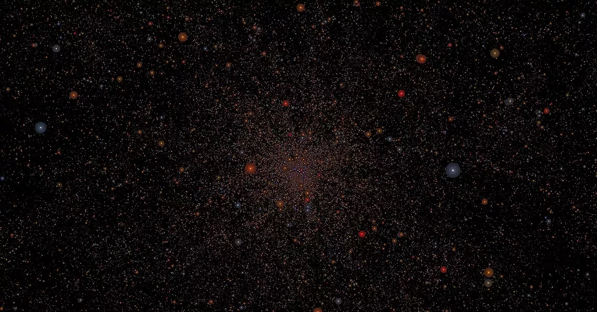
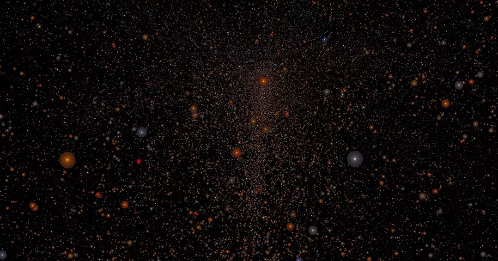

# gaia-universe-model



# [Online documentation](https://mrsinho.github.io/docs/gaia-universe-model/index)

# Roadmap

* Load data from cloud
* Navigate to a specific region from menu
* Launcher
* Menu options:
	Universe LOD
	search bar:
		* by RA DEC position or name
* Highlight region with cursor
	* point to coords
* resize shader

- [Setup](#setup)
	* [Clone and build](#clone-and-build)
	* [Generate CMake targets](#generate-cmake-targets)
	* [Build](#build)
	* [Setup GEDR3 Universe Model data](#build)

- [Testing](#testing)


---


# Setup



## To do:
- [ ] Update from GEDR3 to GDR3
- [ ] Gui for settings and star info
- [ ] Better star shader

## Clone and Build

Open the terminal and run the following commands:

### Generate cmake targets

```bash
git clone --recursive https://github.com/MrSinho/gaia-universe-model.git
cd gaia-universe-model
cd external/shengine
python export-simulation.py gaia-universe-model SHARED ../../gaia-universe-model
```

if you get a python syntax error specify the python version (must be 3.0 or greater).

### Build

```bash
cd build 
cmake --build .
```

## Setup GEDR3 Universe Model data


Before downloading the GEDR3 Universe Model data assume that you want to visualize up to 25 files out of 5000 (not all the files are available, check [gaia-resources](https://github.com/mrsinho/gaia-resources)):

```bash
cd scripts
python ../external/gaia-archive-tools/scripts/download-resources.py 0 25
```

Now navigate to [gaia-universe-model/gaia-universe-model/assets/descriptors/universe-model.json/assets/descriptors/universe-model.json](https://github.com/MrSinho/gaia-universe-model/blob/main/gaia-universe-model/gaia-universe-model/assets/descriptors/universe-model.json) and change the `source_range` array values:

```json
{
    "source_range": [ 0, 25 ]
}
```

# Testing


Go to `external/shengine/bin` and run the executable named `sheditor`.
To move use the `WASD` keys and set the camera speed with `012345`.

<button class="btn">[top](#gaia-universe-model-library-walkthrough)</button>
<button class="btn">[back to docs](./index.md)</button>
