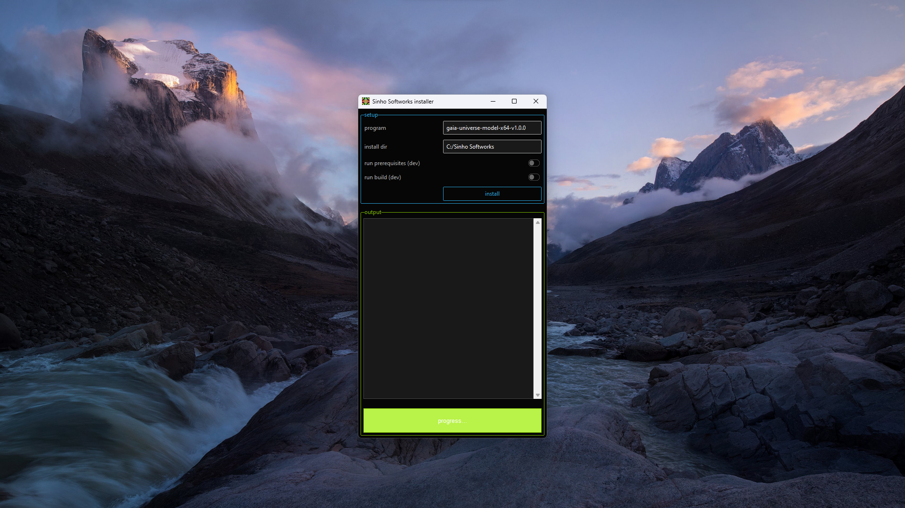
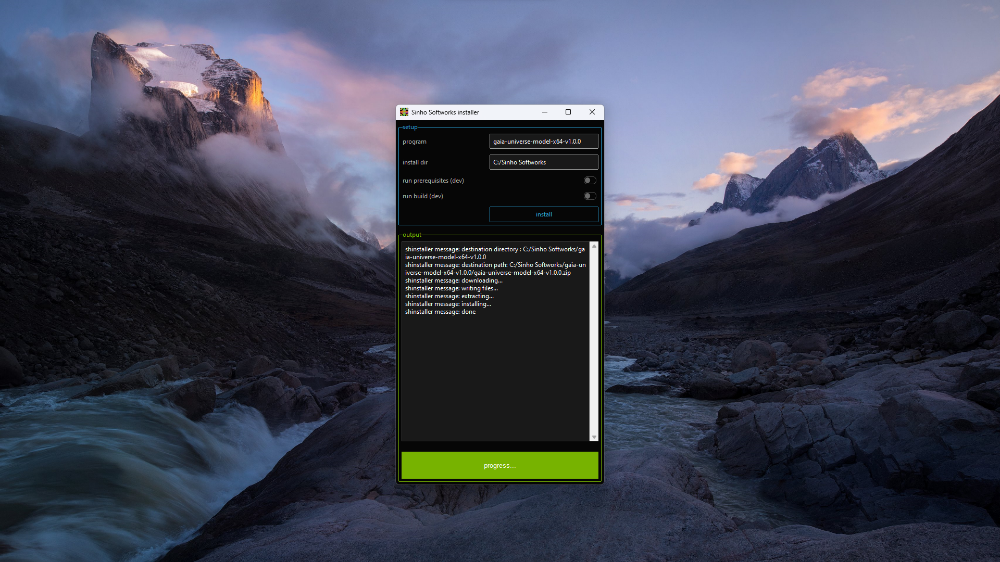
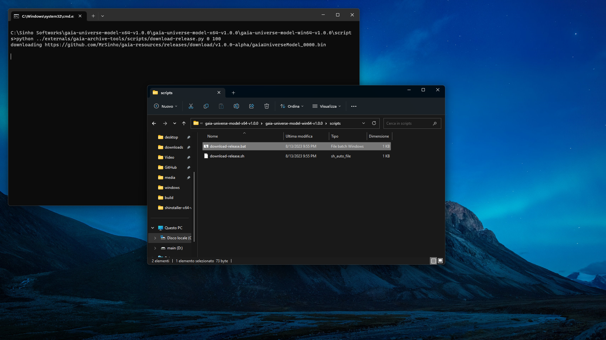
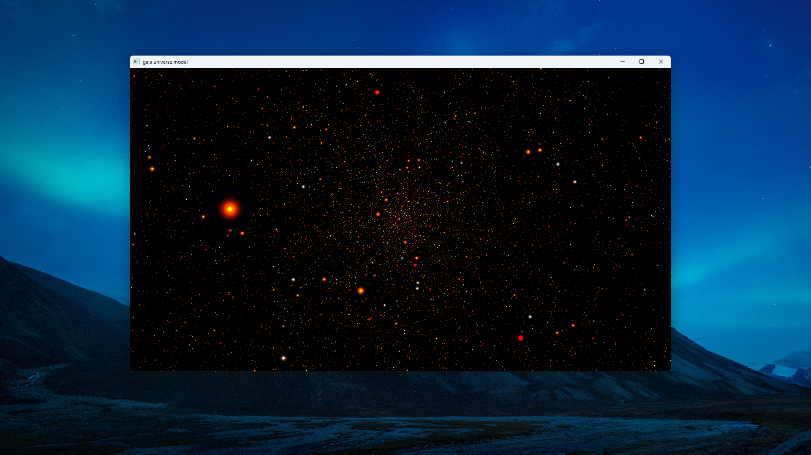

# Install latest release using [shinstaller](https://github.com/MrSinho/gaia-universe-model/releases/latest)

---

## 1. Run shinstaller

Just download, and extract the [`shinstaller`](https://github.com/MrSinho/gaia-universe-model/releases/latest) zip file included in the [_Gaia Universe Model latest release_](https://github.com/MrSinho/gaia-universe-model/releases/latest). After running the executable (or the python script for linux users), an interface similar to this one will appear on your Desktop (the version name might be different):

If you need to change the `installation directory`, you can change it before installing. Press install:

---

## 2. Install Gaia Data Release binaries

> Note: the following step needs a python3.11+ interpreter to be already installed in your system.

Now navigate to the installation path and find the `scripts` directory (by default: `C:\Sinho Softworks\gaia-universe-model-x64-v1.0.0\gaia-universe-model-x64-v1.0.0\gaia-universe-model-win64-v1.0.0\scripts`).

If you're working on a windows system, run `download-release.bat`, and wait until the console application closes automatically:

---

## 3. Run executable

Starting from the root directory of the program, go to `gaia-universe-model/windows_or_linux/bin` and run `gaia-universe-model.exe`. By default, on Windows, the executable path is located here: `C:\Sinho Softworks\gaia-universe-model-x64-v1.0.0\gaia-universe-model-x64-v1.0.0\gaia-universe-model-win64-v1.0.0\gaia-universe-model\windows\bin`.

---

## 4. How to use gaia-universe-model application

See the guide at [docs/application-tutorial.md](application-tutorial.md)